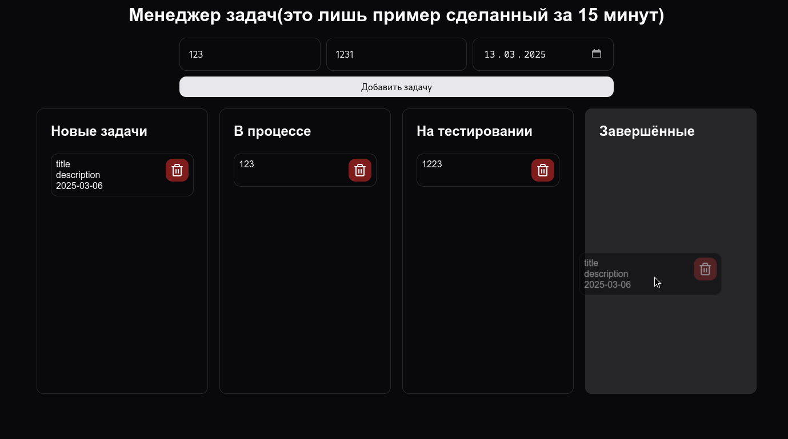

# Задание для хакатона 2025
## Пояснение
Для задания по хакатону предлагается реализовать менеджер задач(аналог [trello](https://trello.com/), [Яндекс Tрекер](https://360.yandex.ru/business/tracker/)) на html/css/js.

> [!WARNING]  
> Использование библиотек, которые не дают больших возможностей, таких как [date-fns](https://date-fns.org/), [Moment.js](https://momentjs.com/) или [Tailwind CSS](https://tailwindcss.com/) разрешено, но не рекомендуется. Написание проекта без их использования будет оцениваться выше.

> [!CAUTION]
> Запрещается использование остальных библиотек и фреймворков, которые дают большой функционал([jQuery](https://jquery.com/), [React](https://react.dev/), [Svelte](https://svelte.dev/), [Vue.js](https://vuejs.org/)).

## Задача минимум:
1. Реализовать добавление и удаление задач(чисто название) в одном едином списке.
2. Реализовать хранение задач в LocalStorage/IndexedDB.
3. Оформить в современном стиле.

## Задача максимум:
1. Добавить описание и сроки к задачам с отображение просроченных.
2. Реализовать разделение на несколько групп-списков(`Новые`, `В работе`, `На тестировании`, `Завершённые`) с возможностью переключения кнопками через меню.
3. Реализовать drag-and-drop для групп-списков.
4. Реализовать разделение на "команды"(разные списки задач, которые могут использоваться для отслеживания нескольких команд).
5. Сделать backend на любом языке и с любыми фреймворками и привязать frontend.

> [!TIP]
> Задания максимума является не обязательными, но дают возможность получить дополнительные баллы.

## Пример
Далее приведён простой пример, который был сделан за 15 минут. Он не идеален и сделан, чтобы дать представление, как должен выглядеть сайт.
### Полностью решённые задачи в примере
- [x] Реализовать добавление и удаление задач(чисто название) в одном едином списке.
- [x] Реализовать хранение задач в LocalStorage/IndexedDB.
- [x] Оформить в современном стиле.
- [ ] Добавить описание и сроки к задачам с отображение просроченных.
- [x] Реализовать разделение на несколько групп-списков(`Новые`, `В работе`, `На тестировании`, `Завершённые`) с возможностью переключения кнопками через меню.
- [x] Реализовать drag-and-drop для групп-списков.
- [ ] Реализовать разделение на "команды"(разные списки задач, которые могут использоваться для отслеживания нескольких команд).
- [ ] Сделать backend на любом языке и с любыми фреймворками и привязать frontend.
### Изображения примера
> [!WARNING]  
> Ваша реализация не обязательно должна выглядеть также, приветствуется творческий подход.

